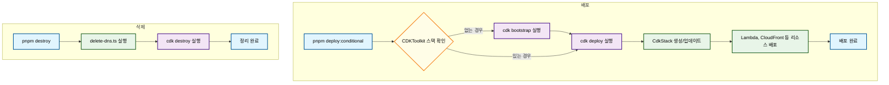

# Infrastructure Package

AWS CDK를 사용한 서버리스 배포 시스템입니다.

## 🚀 주요 기능

- **AWS CDK 배포**: Lambda Function URL과 CloudFront 배포
- **조건부 배포**: CI/CD 환경에서 CDK 부트스트랩 여부를 확인하여 자동으로 첫 배포 또는 업데이트 배포를 수행합니다.
- **DNS 레코드 삭제**: Cloudflare DNS 레코드 정리 기능

## 📋 실행 흐름



## 🛠️ 스크립트 명령어

### 메인 명령어
- `pnpm deploy:conditional`: **(권장)** CI/CD 환경이나 로컬에서 사용하는 기본 배포 명령어입니다. CDK 부트스트랩이 필요한 경우 자동으로 실행하고 배포까지 진행합니다. 이미 부트스트랩된 환경에서는 배포만 수행합니다.
- `pnpm destroy`: DNS 레코드를 먼저 삭제한 후, CDK로 생성된 모든 AWS 리소스를 정리합니다.

### 개별 명령어 (개발 및 디버깅용)
- `pnpm bootstrap`: CDK 부트스트랩과 첫 배포를 함께 실행합니다. (`deploy:conditional`에 포함된 기능)
- `pnpm deploy`: 부트스트랩이 완료된 환경에서 인프라를 배포합니다. (hotswap 모드)
- `npx cdk destroy --force`: CDK 스택만 강제로 삭제합니다.
- `node delete-dns.ts`: Cloudflare의 DNS 레코드만 삭제합니다.

## 🔧 환경변수 설정

### 필수 환경변수
```bash
# AWS 관련
AWS_ACCOUNT_ID=your-aws-account-id
AWS_DEFAULT_REGION=ap-northeast-2

# Cloudflare 관련 (DNS 삭제 시 필요)
CLOUDFLARE_API_TOKEN=your-cloudflare-api-token
CLOUDFLARE_ACCOUNT_ID=your-cloudflare-account-id
```

### DNS 삭제 관련 환경변수
```bash
# 도메인 설정 (선택사항 - 없으면 DNS 삭제 건너뜀)
DOMAIN=example.com
SUBDOMAIN=api  # 선택사항 - 없으면 메인 도메인 사용

# DNS 레코드 설정
RECORD_TYPE=CNAME
RECORD_VALUE=lambda-url.amazonaws.com
TTL=300
```

## 📝 환경변수 설정 규칙

### DOMAIN 처리
- **DOMAIN이 설정되지 않은 경우**: DNS 삭제를 완전히 건너뜁니다
- **DOMAIN이 설정된 경우**: DNS 삭제를 진행합니다

### SUBDOMAIN 처리
- **SUBDOMAIN이 없는 경우**: 메인 도메인(example.com)에 레코드 설정
- **SUBDOMAIN이 있는 경우**: 서브도메인(api.example.com)에 레코드 설정

## 🔄 배포 및 정리 프로세스

### 배포 프로세스
1. **조건부 배포**: `pnpm deploy:conditional` 명령어를 실행합니다.
2. **CDK 부트스트랩 확인**: 스크립트가 AWS 환경에 `CDKToolkit` 스택이 있는지 확인합니다.
    - **없는 경우**: `cdk bootstrap`을 실행하여 배포에 필요한 기본 리소스를 설정한 후 배포를 진행합니다.
3. **CDK 배포**: `cdk deploy`를 실행하여 Lambda, CloudFront 등 정의된 모든 리소스를 AWS에 배포(또는 업데이트)합니다.

### 정리 프로세스
1. **통합 삭제**: `pnpm destroy`를 실행하여 DNS 레코드 삭제와 CDK 스택 삭제를 한 번에 진행합니다.

## ⚠️ 주의사항

- **DOMAIN 환경변수가 없으면** DNS 삭제는 자동으로 건너뜁니다.
- CI/CD 환경에 AWS CLI가 설치되어 있고, AWS 자격 증명이 설정되어 있어야 합니다.

## 🚨 트러블슈팅

### DNS 삭제 실패 시
DNS 삭제가 실패한 경우 수동으로 실행:
```bash
cd packages/aws-infra
node delete-dns.ts
```

### CDK 스택 삭제 실패 시
CDK 스택 삭제가 실패한 경우:
```bash
cd packages/aws-infra
npx cdk destroy --force
```
