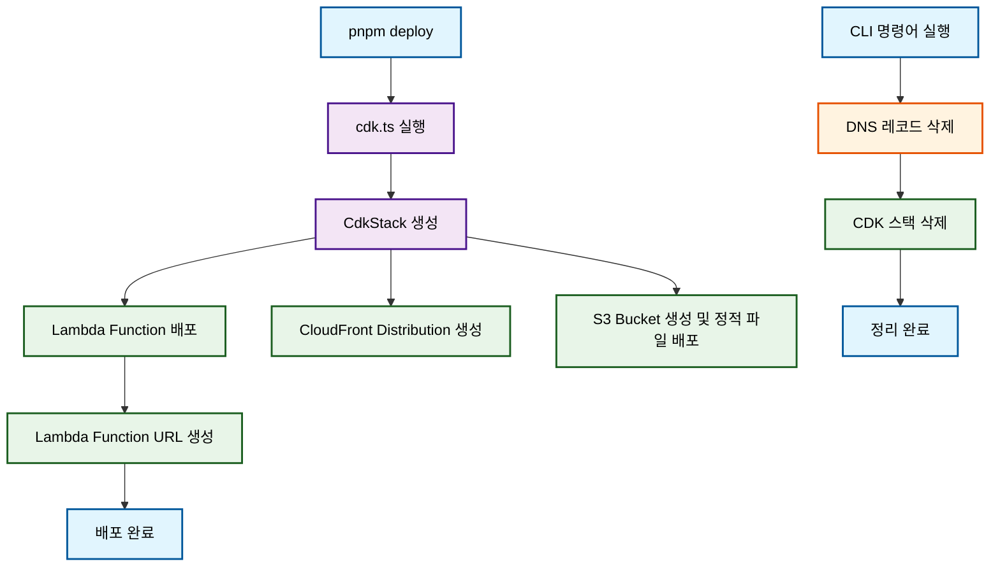

# Infrastructure Package

AWS CDK를 사용한 서버리스 배포 시스템입니다.

## 🚀 주요 기능

- **AWS CDK 배포**: Lambda Function URL과 CloudFront 배포
- **DNS 레코드 삭제**: Cloudflare DNS 레코드 정리 기능

## 📋 실행 흐름



## 🛠️ 스크립트 명령어

### 배포 관련
- `pnpm bootstrap`: CDK 부트스트랩 및 첫 배포
- `pnpm deploy`: CDK 배포 (hotswap 모드)

### 삭제 관련
- `npx cdk destroy --force`: CDK 스택만 삭제
- `node delete-dns.ts`: DNS 레코드만 삭제
- `node delete-dns.ts && npx cdk destroy --force`: DNS + CDK 스택 모두 삭제

## 🔧 환경변수 설정

### 필수 환경변수
```bash
# AWS 관련
AWS_ACCOUNT_ID=your-aws-account-id
AWS_DEFAULT_REGION=ap-northeast-2

# Cloudflare 관련 (DNS 삭제 시 필요)
CLOUDFLARE_API_TOKEN=your-cloudflare-api-token
CLOUDFLARE_ACCOUNT_ID=your-cloudflare-account-id
```

### DNS 삭제 관련 환경변수
```bash
# 도메인 설정 (선택사항 - 없으면 DNS 삭제 건너뜀)
DOMAIN=example.com
SUBDOMAIN=api  # 선택사항 - 없으면 메인 도메인 사용

# DNS 레코드 설정
RECORD_TYPE=CNAME
RECORD_VALUE=lambda-url.amazonaws.com
TTL=300
```

## 📝 환경변수 설정 규칙

### DOMAIN 처리
- **DOMAIN이 설정되지 않은 경우**: DNS 삭제를 완전히 건너뜁니다
- **DOMAIN이 설정된 경우**: DNS 삭제를 진행합니다

### SUBDOMAIN 처리
- **SUBDOMAIN이 없는 경우**: 메인 도메인(example.com)에 레코드 설정
- **SUBDOMAIN이 있는 경우**: 서브도메인(api.example.com)에 레코드 설정

## 🌐 DNS 관리 방식

### DNS 레코드 삭제
```bash
pnpm delete-dns
```

## 🔄 배포 및 정리 프로세스

### 배포 프로세스
1. **CDK 배포**: `pnpm deploy` 실행
2. **Lambda 생성**: AWS Lambda Function URL 생성
3. **CloudFront 배포**: 정적 파일 배포

### 정리 프로세스
1. **DNS 삭제**: `node delete-dns.ts` 실행
2. **CDK 스택 삭제**: `npx cdk destroy --force` 실행
3. **통합 삭제**: `node delete-dns.ts && npx cdk destroy --force` (한 번에 실행)

## ⚠️ 주의사항

- **DOMAIN 환경변수가 없으면** DNS 삭제는 자동으로 건너뜁니다
- **Wrangler CLI 사용 시** `wrangler` 명령어가 전역으로 설치되어야 합니다

## 🚨 트러블슈팅

### DNS 삭제 실패 시
DNS 삭제가 실패한 경우 수동으로 실행:
```bash
cd packages/infra
node delete-dns.ts
```

### CDK 스택 삭제 실패 시
CDK 스택 삭제가 실패한 경우:
```bash
cd packages/infra
npx cdk destroy --force
```

### Wrangler CLI 설치
```bash
npm install -g wrangler
```